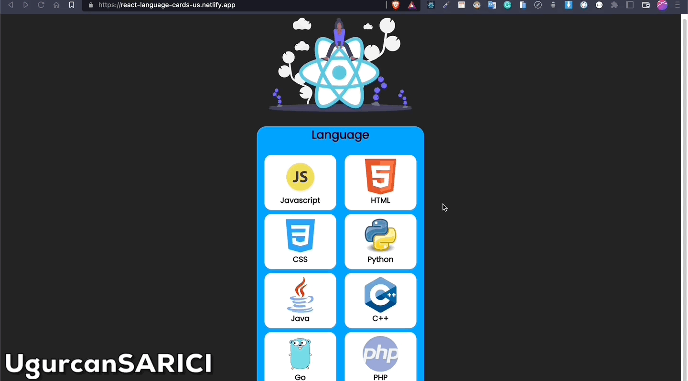

# Project : Weather App

## Table of contents

  - [The challenge](#the-challenge)
  - [Screenshot](#screenshot)
  - [Project Skeleton ](#project-skeleton)
  - [Links](#links)
  - [Built with](#built-with)
  - [Useful resources](#useful-resources)


## The challenge
Project aims to create a Language Cards app with React and Bootstrap

## Problem Statement

- Develop a language cards app to improve your REACT knowledge and practice with Bootstrap
<hr>


## Project Skeleton 

```
Language Cards(folder)
|
|----readme.md   
|
|----lang.gif        
|
├── public
│     └── index.html
├── src
│    ├── components
│    │       ├── Card.css
│    │       └── Card.js
│    ├── helper
│    │       └── data.js
│    ├── assets.js
│    │       └── [images]
│    ├── App.js
│    ├── App.css
│    ├── index.js
│    └── index.css
├── package.json
```


## Screenshot
<p align="center">
<a href="https://react-language-cards-us.netlify.app/"></a>
</p>


## Links
<hr>
<b>Check The Live Website ➡️</b> <a href="https://react-language-cards-us.netlify.app/">Live Website</a>
<hr>

### Built with

- React Components, props, states, hooks

- React click events , functions

- JSX Elements

- CSS custom properties


## Notes

- You can use HTML,CSS ,JAVASCRIPT and REACT to complete this project.

### Useful resources

- [W3 Schoold](https://www.w3schools.com/) 
- [MDN](https://developer.mozilla.org/en-US/) 
- [REACT](https://reactjs.org/) 


<center> &#8987; Happy Coding  &#9997; </center>
